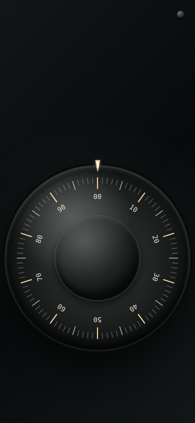

# safe-cracka

A mobile safe-dial game built with HTML, CSS, and JavaScript.

This project was generated by AI.

## Combination sequences

The default three-number mode uses:

1. Turn counterclockwise and stop on the first number after at least four passes.
2. Turn clockwise and stop on the second number after at least three passes.
3. Turn counterclockwise and stop on the third number after at least two passes.
4. Turn clockwise to 69 to open the safe.

Four-number mode adds another random number: turn counterclockwise, clockwise,
counterclockwise, and clockwise for 5, 4, 3, and 2 passes respectively, then
turn counterclockwise to 69.

The button in the top-right opens persistent settings for diagnostics, the target
indicator, haptic/sound feedback, and combination length.
